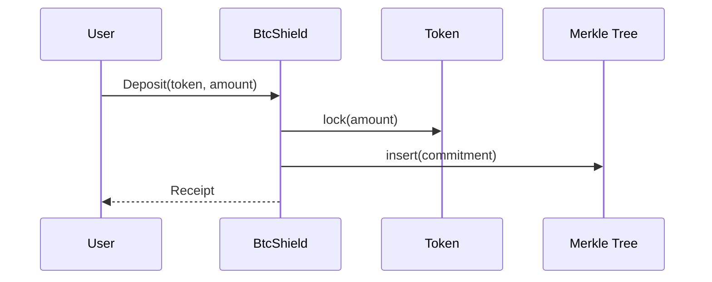
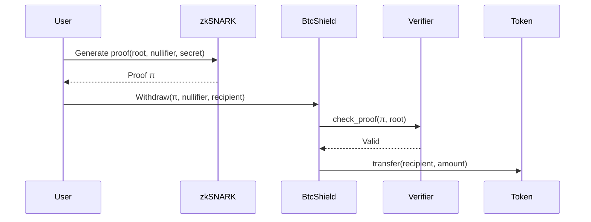

# BtcShield - Privacy-Preserving Token Pool for Stacks

**BtcShield** is a privacy protocol for the [Stacks](https://www.stacks.co/) blockchain, enabling confidential transfers of SIP-010 compliant tokens using **zk-SNARKs** and **Merkle trees**. It allows users to shield deposits and withdraw anonymously, preserving privacy without compromising security or auditability.

## 🔍 Overview

* **Network:** Stacks (L2 Bitcoin-secured)
* **Privacy Layer:** zk-SNARK proofs + Merkle commitment tree
* **Token Compatibility:** SIP-010 fungible tokens
* **Design Principle:** Full privacy with Bitcoin-anchored settlement

## 🔐 Key Features

* **End-to-End Privacy:** Breaks deposit-withdrawal links using zero-knowledge proofs
* **Non-Custodial:** Users control their tokens via cryptographic commitments
* **Scalability:** Merkle accumulator supports over 1 million entries (2²⁰ leaves)
* **Bitcoin Settlement:** Anchored to Bitcoin via Stacks’ PoX architecture
* **Anti-Double-Spend:** Nullifier registry enforces one-time withdrawal

## 🛠️ Contract Interface

### Traits

```clarity
(use-trait <ft-trait> .sip010-token)
```

Conforms to the [SIP-010 Fungible Token Standard](https://github.com/stacksgov/sips/blob/main/sips/sip-010/sip-010-fungible-token-standard.md).

### Public Functions

* `deposit(commitment, amount, token)`
  Locks `amount` of `token`, updates Merkle tree, and emits deposit event.

* `withdraw(nullifier, root, proof, recipient, token, amount)`
  Verifies zk-proof and nullifier, transfers tokens to `recipient` if valid.

### Read-Only Functions

* `get-current-root()` → Returns current Merkle root
* `is-nullifier-used(nullifier)` → Checks nullifier reuse
* `get-deposit-info(commitment)` → Metadata for a commitment (if exposed)

## ⚙️ Architecture

### Core Components

* **zk-SNARK Circuit:**
  Proves knowledge of a secret & nullifier pair that maps to a Merkle leaf.

* **Merkle Tree:**
  On-chain binary tree with SHA-256 hashing; 2²⁰ depth (1M+ entries).

* **Nullifier Set:**
  Prevents reuse of secrets, ensuring withdrawal uniqueness.

* **Shielded Pool Engine:**
  SIP-010 token escrow with proof verification logic.

### System Flow

#### Deposit



#### Withdraw



---

## 🧪 Local Testing

### Prerequisites

* Node.js v18+
* Clarinet SDK
* Bitcoin testnet (for integration testing)

### Setup

```bash
git clone https://github.com/yourorg/btcshield
cd btcshield/clarity-contracts
clarinet install
```

### Sample Deposit Script (TypeScript)

```ts
const deposit = async (token: string, amount: number) => {
  const secret = generateSecret();
  const commitment = computeCommitment(secret);
  
  await callContractMethod(
    'BtcShield',
    'deposit',
    [types.buff(commitment), types.uint(amount), types.principal(token)]
  );
  
  return { secret, commitment };
};
```

### Sample Withdrawal Script (TypeScript)

```ts
const withdraw = async (recipient: string, amount: number, secret: Uint8Array) => {
  const { proof, nullifier } = await generateZKProof(secret);

  await callContractMethod(
    'BtcShield',
    'withdraw',
    [
      types.buff(nullifier),
      types.buff(currentRoot),
      types.list(proof.map(p => types.buff(p))),
      types.principal(recipient),
      types.principal(tokenAddress),
      types.uint(amount)
    ]
  );
};
```

---

## 🔒 Security Model

* **Trusted Setup:** Secure multi-party ceremony for zk-SNARK circuit
* **Cryptographic Assumptions:** SHA-256 collision resistance, SNARK soundness
* **Blockchain Guarantees:** Stacks ensures accurate state anchoring via Bitcoin

### Audit Plan

| Component        | Auditor      | Status          |
| ---------------- | ------------ | --------------- |
| zk Circuit       | CertiK       | Planned Q4 2024 |
| Clarity Contract | OpenZeppelin | In Progress     |

## ⚠️ Known Limitations

* Proof generation is off-chain and requires tooling (e.g., `snarkjs`)
* No UTXO-style mixer (deposits/withdrawals are account-based)
* Merkle tree capped at 2²⁰ leaves (scalable with deeper trees in future)

## 🧭 Future Directions

* Batch withdrawals for gas optimization
* Off-chain event indexer (privacy-preserving analytics)
* DID integration for regulated private finance use cases

## 🤝 Contributing

1. Fork this repo
2. Create a branch (`feature/my-update`)
3. Commit and push your changes
4. Submit a Pull Request for review
